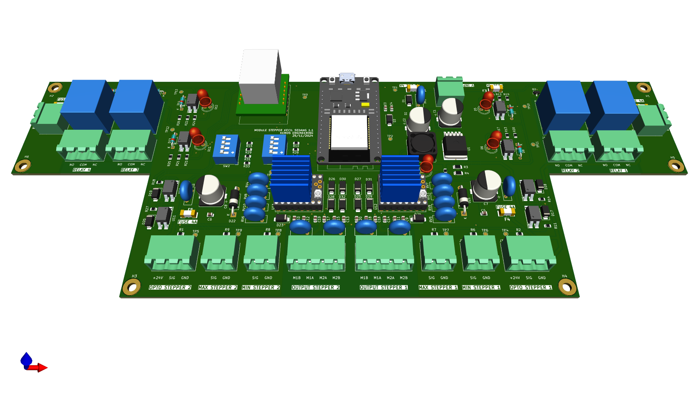

# Portofolio Desain PCB
Selamat datang di portofolio desain PCB saya! Di sini, Anda dapat melihat berbagai proyek PCB yang telah saya rancang dan buat. Portofolio ini mencakup berbagai desain yang menunjukkan keterampilan saya dalam merancang sirkuit elektronika, baik untuk aplikasi industri maupun pribadi.

## Daftar Proyek

Berikut adalah beberapa proyek PCB yang telah saya kerjakan:

1. **Proyek 1: [Nama Proyek]**
   - Deskripsi: Desain PCB untuk [deskripsi singkat tentang proyek]
   - Tools yang digunakan: [Alat perangkat lunak yang digunakan, misalnya Eagle, Altium Designer, KiCad, dsb.]
   - Fitur utama: [Fitur atau keunikan proyek ini]
   - Gambar: |  |

## Tools yang Digunakan

Berikut adalah alat yang saya gunakan untuk merancang PCB:

- **Perangkat Lunak Desain PCB:** KiCad, Eagle, Altium Designer, EasyEDA, SprintLayout, dsb.
- **Proses:** Pembuatan diagram blok sistem, Perancangan skematik, routing, analisis DFM, dll.
- **Material:**
- **Perangkat Pengujian:** Proteus, Wokwi, LTSpice

## Proses Kerja

1. Menyusun spesifikasi dan kebutuhan fungsional untuk desain PCB.
2. Membuat skematik sirkuit menggunakan perangkat lunak desain.
3. Melakukan routing untuk menciptakan layout fisik dari sirkuit.
4. Memastikan desain memenuhi standar kualitas dan fungsionalitas.
5. Setelah desain selesai, PCB diuji untuk memastikan kinerjanya.

## Pictures
Here are the pictures of my previous PCB design and fabrication work:

## Hubungi Saya

Jika Anda tertarik untuk mendiskusikan proyek atau bekerja sama, jangan ragu untuk menghubungi saya!

- Email: **wahyucristianto30@gmail.com**

Terima kasih telah mengunjungi portofolio saya!
